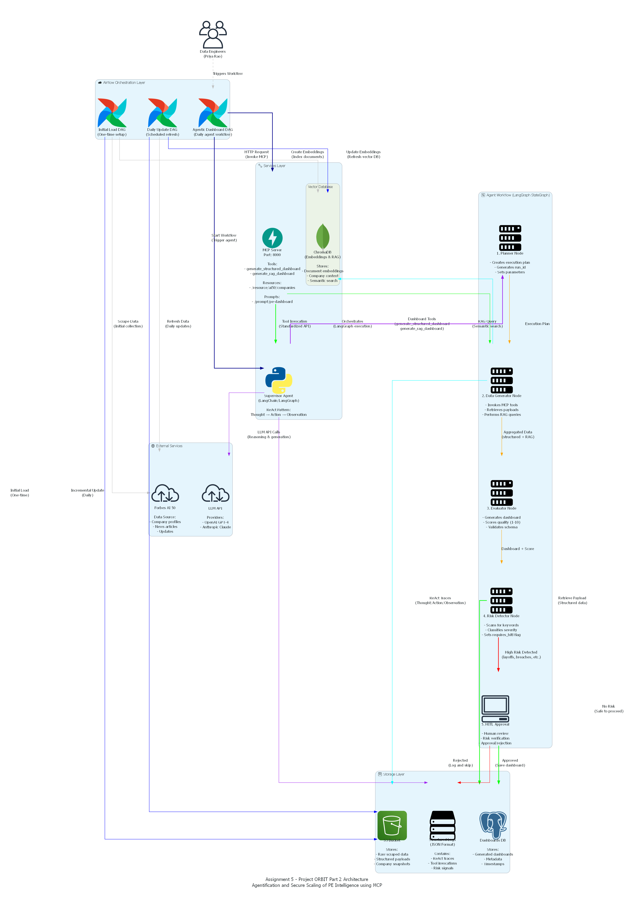

# Assignment 5: Advanced Agent Implementation

## Submission
- Github: [https://github.com/Team-01-DAMG-7245/pe-dashboard-ai50](https://github.com/Team-01-DAMG-7245/pe-dashboard-ai50-v2)
- Codelab Documentation: https://codelabs-preview.appspot.com/?file_id=1S0GCTiO0q3iwqtBaNzO8qBEpWTZAsWwNyMaj3-S0l0o#0
- Demo Video: https://youtu.be/kBuY7KJPcNY
## Architecture Diagram

The following diagram illustrates the complete system architecture for Assignment 5 - Project ORBIT Part 2, showing the integration of Airflow orchestration, MCP Server, Supervisor Agent, and the LangGraph workflow with Human-in-the-Loop (HITL) approval.



### Diagram Components

- **☁️ Airflow Orchestration Layer**: 3 DAGs (Initial Load, Daily Update, Agentic Dashboard)
- **🔧 Services Layer**: MCP Server (Tools/Resources/Prompts), Supervisor Agent (LangChain/LangGraph), Vector DB (ChromaDB)
- **🔄 Agent Workflow**: 5 nodes with conditional branching (Planner → Data Generator → Evaluator → Risk Detector → HITL)
- **💾 Storage Layer**: S3 Bucket, PostgreSQL (Dashboards DB), Structured Logs (JSON ReAct Traces)
- **🌐 External Services**: LLM API (OpenAI/Anthropic), Forbes AI 50 (Data Source)

### Workflow Flow

```
Planner → Data Generator → Evaluator → Risk Detector → [HITL or Save]
```

**To regenerate the diagram:**
```powershell
python scripts/generate_architecture_diagram.py
```

---

## Contributions

This assignment was completed collaboratively with the following phase assignments:

- **Phase 1 & 2**: Kundana
- **Phase 3**: Swara
- **Phase 4**: Natnicha

## Lab 12: Core Agent Tools

**Run unit tests:**
```powershell
python -m pytest tests/test_tools.py -v
```

**Expected:** All tool tests pass (get_latest_structured_payload, rag_search_company, report_layoff_signal)

---

## Lab 13: Supervisor Agent Bootstrap

**Run Supervisor Agent:**
```powershell
cd "C:\Users\Swara\Desktop\Big Data Assignments\damg7245-assignmnet4\forbes-ai50-dashboard-assignment4"
$env:PYTHONPATH="src"
python src\lab13\supervisor_agent.py
```

**Expected:** Console logs show Thought → Action → Observation sequence

---

## Lab 14: MCP Server Implementation

**Build MCP Server Docker image:**
```powershell
docker build -f Dockerfile.mcp -t mcp-server .
```

**Run MCP Server:**
```powershell
docker run -p 9000:9000 --env-file .env mcp-server
```

**Or run directly:**
```powershell
cd "C:\Users\Swara\Desktop\Big Data Assignments\damg7245-assignmnet4\forbes-ai50-dashboard-assignment4"
$env:PYTHONPATH="src"
python src\lab14\server\mcp_server.py
```

**Verify MCP Inspector:**
- Open MCP Inspector tool
- Connect to `http://localhost:9000`
- Verify registered tools/resources/prompts

---

## Lab 15: Agent MCP Consumption

**Configure mcp_config.json:**
```json
{
  "base_url": "http://localhost:9000",
  "tools": ["generate_structured_dashboard", "generate_rag_dashboard"]
}
```

**Run integration test:**
```powershell
python -m pytest tests/test_mcp_server.py -v
```

**Run Agent with MCP:**
```powershell
cd "C:\Users\Swara\Desktop\Big Data Assignments\damg7245-assignmnet4\forbes-ai50-dashboard-assignment4"
$env:PYTHONPATH="src"
python src\lab15\agent_mcp_client.py
```

**Expected:** Agent → MCP → Dashboard → Agent round trip works

---

## Lab 16: ReAct Pattern Implementation

**Run ReAct Agent:**
```powershell
cd "C:\Users\Swara\Desktop\Big Data Assignments\damg7245-assignmnet4\forbes-ai50-dashboard-assignment4"
$env:PYTHONPATH="src"
python src\lab16\react_agent.py --company anthropic
```

**Check logs:**
```powershell
# View JSON logs
Get-Content logs\react_traces\*.json | ConvertFrom-Json | Format-List

# Or view trace example
cat docs\REACT_TRACE_EXAMPLE.md
```

**Expected:** JSON logs show sequential ReAct steps with Thought/Action/Observation triplets

---

## Lab 17: Supervisory Workflow Pattern (Graph-based)

**Terminal 1 - Start MCP Server:**
```powershell
cd "C:\Users\Swara\Desktop\Big Data Assignments\damg7245-assignmnet4\forbes-ai50-dashboard-assignment4"
$env:PYTHONPATH="src"
$env:KMP_DUPLICATE_LIB_OK="TRUE"
python -c "import sys; sys.path.insert(0, 'src'); from server.mcp_server import app; import uvicorn; uvicorn.run(app, host='0.0.0.0', port=9000)"
```

**Terminal 2 - Start API Server:**
```powershell
cd "C:\Users\Swara\Desktop\Big Data Assignments\damg7245-assignmnet4\forbes-ai50-dashboard-assignment4"
$env:PYTHONPATH="src"
$env:KMP_DUPLICATE_LIB_OK="TRUE"
python src\lab7\rag_dashboard.py
```

**Terminal 3 - Run Workflow:**
```powershell
cd "C:\Users\Swara\Desktop\Big Data Assignments\damg7245-assignmnet4\forbes-ai50-dashboard-assignment4"
$env:PYTHONPATH=""
python -m src.workflows.due_diligence_graph anthropic
```

**Run unit tests:**
```powershell
python -m pytest tests/test_workflow_branches.py -v
```

**View workflow diagram:**
```powershell
cat docs\WORKFLOW_GRAPH.md
```

**Output:** Dashboard saved to `data/workflow_dashboards/{company_id}_{run_id}_{timestamp}.md`

---

## Lab 18: HITL Approval

### CLI Mode (Default)

```powershell
cd "C:\Users\Swara\Desktop\Big Data Assignments\damg7245-assignmnet4\forbes-ai50-dashboard-assignment4"
$env:PYTHONPATH=""
python -m src.workflows.due_diligence_graph anthropic
# When prompted, type 'yes' or 'no'
```

### HTTP Mode

**Terminal 1 - Start HITL Server:**
```powershell
.\start_hitl_server.ps1
```

**Terminal 2 - Start API Server:**
```powershell
$env:PYTHONPATH="src"
$env:KMP_DUPLICATE_LIB_OK="TRUE"
python src\lab7\rag_dashboard.py
```

**Terminal 3 - Run Workflow:**
```powershell
$env:HITL_METHOD="http"
$env:HITL_BASE_URL="http://localhost:8003"
$env:PYTHONPATH=""
python -m src.workflows.due_diligence_graph anthropic
```

**Terminal 4 - Approve/Reject:**

**PowerShell Scripts:**
```powershell
.\check_hitl_status.ps1
.\approve_hitl.ps1 -RunId "{run_id}" -Approved -Reviewer "admin" -Notes "Approved"
.\approve_hitl.ps1 -RunId "{run_id}" -Rejected -Reviewer "admin" -Notes "Rejected"
```

**Direct PowerShell:**
```powershell
$body = @{approved=$true; reviewer="admin"; notes="Approved"} | ConvertTo-Json
Invoke-RestMethod -Uri "http://localhost:8003/hitl/approve/{run_id}" -Method Post -Body $body -ContentType "application/json"
```

**curl.exe:**
```powershell
curl.exe -X POST http://localhost:8003/hitl/approve/{run_id} -H "Content-Type: application/json" -d "{\"approved\": true, \"reviewer\": \"admin\", \"notes\": \"Approved\"}"
```

---

## Phase 3 Validation & Testing

### Validate Phase 3 Completion

**Run validation script:**
```powershell
python scripts/validate_phase3.py
```

**Expected:** All checks pass (29/29) for Labs 16, 17, 18

**What it checks:**
- Lab 16: ReAct Logger file, class, documentation, trace logs
- Lab 17: Workflow graph, nodes, conditional edges, documentation
- Lab 18: HITL handler, CLI/HTTP methods, workflow integration
- Testing: Integration tests, branch coverage, mock HITL

### Run Integration Tests

**Run all Phase 3 integration tests:**
```powershell
python -m pytest tests/test_phase3_integration.py -v
```

**Run specific scenarios:**
```powershell
# Normal flow (no risks)
python -m pytest tests/test_phase3_integration.py::test_normal_flow_no_risks -v

# High-risk flow with approval
python -m pytest tests/test_phase3_integration.py::test_high_risk_flow_with_approval -v

# High-risk flow with rejection
python -m pytest tests/test_phase3_integration.py::test_high_risk_flow_with_rejection -v

# Complete end-to-end integration
python -m pytest tests/test_phase3_integration.py::test_complete_integration_flow -v
```

**Expected:** All 12 tests pass (3 normal flow, 3 approval, 3 rejection, 1 complete, 2 edge cases)

### Visualize Workflow Execution

**Generate workflow visualization from trace:**
```powershell
python scripts/visualize_workflow.py logs/workflow_traces/workflow_trace_{run_id}_{timestamp}.json
```

**Expected:** Mermaid diagram showing execution path, HITL decision points, and branch taken

### View Workflow Traces

**List workflow traces:**
```powershell
Get-ChildItem logs\workflow_traces\*.json
```

**View trace content:**
```powershell
Get-Content logs\workflow_traces\workflow_trace_{run_id}_{timestamp}.json | ConvertFrom-Json | ConvertTo-Json -Depth 10
```

**View ReAct traces:**
```powershell
Get-Content logs\react_traces\*.json | ConvertFrom-Json | Format-List
```

---

## Quick Reference

**Checkpoints:**
- Lab 12: `pytest tests/test_tools.py -v`
- Lab 13: Check console logs for ReAct sequence
- Lab 14: MCP Inspector shows registered tools/resources/prompts
- Lab 15: `pytest tests/test_mcp_server.py -v`
- Lab 16: Check JSON logs in `logs/react_traces/`
- Lab 17: `pytest tests/test_workflow_branches.py -v` + workflow diagram
- Lab 18: HITL approval works via CLI or HTTP
- Phase 3: `python scripts/validate_phase3.py` (should show 100% complete)

**Common Commands:**
```powershell
# Set PYTHONPATH
$env:PYTHONPATH="src"

# Run all tests
python -m pytest tests/ -v

# Run Phase 3 validation
python scripts/validate_phase3.py

# Run integration tests
python -m pytest tests/test_phase3_integration.py -v

# Check logs
Get-Content logs\react_traces\*.json
Get-Content logs\workflow_traces\*.json

# View documentation
cat docs\WORKFLOW_GRAPH.md
cat docs\REACT_TRACE_EXAMPLE.md

# Visualize workflow
python scripts/visualize_workflow.py logs/workflow_traces/workflow_trace_{run_id}_{timestamp}.json
```

