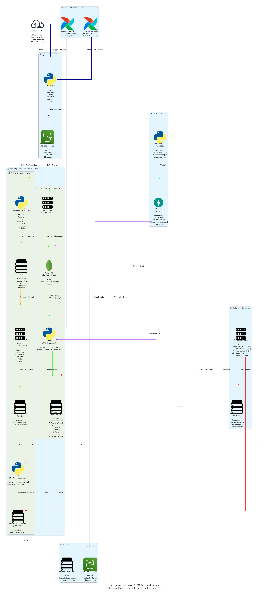
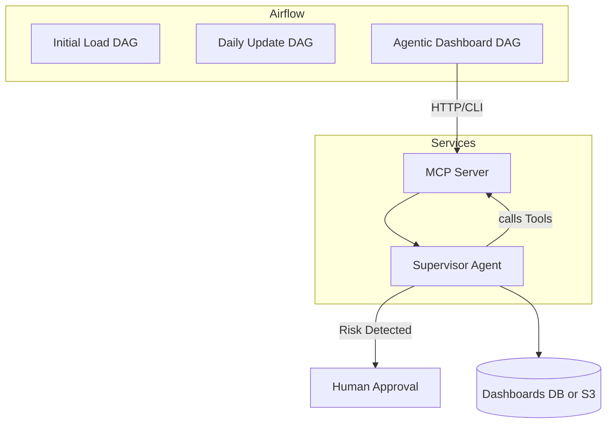

## Case Study 2 — Project ORBIT (Part 2)  
### Agentification and Secure Scaling of PE Intelligence using MCP

---

## 🧭 Setting

In Assignment 4 (Project ORBIT Part 1) you automated ingestion and Markdown dashboard generation for the **Forbes AI 50** using Airflow ETL + FastAPI + Streamlit.  
That system worked, but it was **static**—no reasoning, no secure integration with multiple data tools.

Now, **Priya Rao (VP of Data Engineering)** wants you to evolve it into an **agentic, production-ready platform** that can:

- Orchestrate due-diligence workflows through **supervisory LLM agents**  
- Standardize tool access with the **Model Context Protocol (MCP)**  
- Employ **ReAct reasoning** for transparency  
- Run under **Airflow orchestration** with containerized MCP services  
- Pause for **Human-in-the-Loop (HITL)** review when risks appear  

---

## 🎯 Learning Outcomes

By the end you will:

- Build specialized LLM agents (LangChain v1 or Microsoft Agent Framework)  
- Design a **Supervisory Agent Architecture** that delegates to sub-agents  
- Implement an **MCP server** exposing Tools / Prompts / Resources  
- Apply the **ReAct pattern** (Thought → Action → Observation) with structured logs  
- Compose a **graph-based workflow** (LangGraph or WorkflowBuilder) with conditional edges  
- Integrate **Airflow DAGs**, **Docker**, and **.env configuration** for deployment  
- Add **pytest tests** and structured logging for maintainability  
- Embed **Human-in-the-Loop (HITL)** approval nodes for risk verification  

---

## Architecture Diagram

The following diagram illustrates the complete system architecture for Assignment 4 - Project ORBIT Part 1, showing the two parallel dashboard generation pipelines (RAG and Structured), Airflow orchestration, and the complete data flow from ingestion to evaluation.



### Diagram Components

- **☁️ Airflow Orchestration Layer**: 2 DAGs (Initial Load @once, Daily Refresh 0 3 * * *)
- **📥 Data Ingestion Layer**: Web Scraper (homepage, /about, /product, /careers, /blog) → Raw Storage (S3/GCS)
- **🔄 Processing Layer - Two Parallel Pipelines**:
  - **RAG Pipeline (Unstructured)**: Raw → Chunk → Embed → Vector DB → LLM → Dashboard
  - **Structured Pipeline (Pydantic)**: Raw → Instructor → Pydantic Models → Payload → LLM → Dashboard
- **🌐 API & UI Layer**: FastAPI (port 8000) + Streamlit (port 8501)
- **📊 Evaluation & Comparison**: Rubric-based comparison of RAG vs Structured dashboards
- **💾 Storage Layer**: S3/GCS, Vector DB (ChromaDB), Local storage

### Pipeline Flows

**RAG Pipeline:**
```
Raw HTML → Text Chunker → Vector DB (Embeddings) → LLM (Top-K chunks) → RAG Dashboard
```

**Structured Pipeline:**
```
Raw HTML → Instructor (Pydantic Extraction) → Structured Data → Payload Assembly → LLM (Structured context) → Structured Dashboard
```

**To regenerate the diagram:**
```powershell
python scripts/generate_assignment4_architecture_diagram.py
```

---

## Submission Deliverables
1. **GitHub repo** : https://github.com/Team-01-DAMG-7245/pe-dashboard-ai50
2. **EVAL.md** : https://github.com/Team-01-DAMG-7245/pe-dashboard-ai50/blob/swara/EVAL.md
3. **Demo video** : https://drive.google.com/file/d/1abFljwrx1lSxF5LOVPup7tTnjKDvDKF8/view?usp=sharing
4. **Youtube video** : https://youtu.be/BzeN0LC2-8Q
5. **Reflection.md for Evaluation** : https://github.com/Team-01-DAMG-7245/pe-dashboard-ai50/blob/main/REFLECTION.md
## Quick Start

### Run Airflow (Docker)
```bash
docker compose up
# Access UI: http://localhost:8080 (admin/admin)
```

### Run App Locally (Dev)
```bash
python -m venv airflow_env
source airflow_env/bin/activate
pip install -r requirements.txt
uvicorn src.api:app --reload        # http://localhost:8000
streamlit run src/streamlit_app.py  # http://localhost:8501
```

---

## Project Structure

```
├── dags/                  # Airflow DAGs (Labs 2-3)
├── data/
│   ├── forbes_ai50_seed.json   # Company list (Lab 0)
│   ├── raw/                     # Scraped HTML/text (Lab 1)
│   ├── structured/              # Pydantic models (Lab 5)
│   ├── payloads/                # Dashboard payloads (Lab 6)
│   └── workflow_dashboards/     # Lab 17 workflow outputs
├── src/
│   ├── api.py                   # FastAPI endpoints (Lab 7-8)
│   ├── models.py                # Pydantic schemas (Lab 5)
│   ├── s3_utils.py              # Cloud storage (Lab 1)
│   └── streamlit_app.py         # Dashboard UI (Lab 10)
├── requirements.txt
├── docker-compose.yml
└── README.md
```

---

## Setup

### 1. AWS S3 Configuration
```bash
aws configure  # Enter your credentials
export AWS_BUCKET_NAME=quanta-ai50-data
```

### 2. Seed File
Populate `data/forbes_ai50_seed.json` with Forbes AI 50 companies from https://www.forbes.com/lists/ai50/

### 3. Environment Variables
Create `.env`:
```bash
AWS_BUCKET_NAME=quanta-ai50-data
OPENAI_API_KEY=your-api-key-here
```

---

## 🧱 Project Architecture Overview




🧩 Phase 1 – Agent Infrastructure & Tool Definition (Labs 12–13)

Lab 12 — Core Agent Tools

Implement async Python tools with Pydantic models for structured I/O:

Tool	Purpose
get_latest_structured_payload(company_id)	Return the latest assembled payload from Assignment 2
rag_search_company(company_id, query)	Query the Vector DB for contextual snippets
report_layoff_signal(signal_data)	Log or flag high-risk events (layoffs / breaches)

✅ Checkpoint: Unit tests (tests/test_tools.py) validate each tool’s behavior.

⸻

Lab 13 — Supervisor Agent Bootstrap
	•	Instantiate a Due Diligence Supervisor Agent with system prompt:
“You are a PE Due Diligence Supervisor Agent. Use tools to retrieve payloads, run RAG queries, log risks, and generate PE dashboards.”
	•	Register the three tools.
	•	Verify tool invocation loop via ReAct logs.

✅ Checkpoint: Console logs show Thought → Action → Observation sequence.

⸻

🌐 Phase 2 – Model Context Protocol (MCP) Integration (Labs 14–15)

Lab 14 — MCP Server Implementation

Create src/server/mcp_server.py exposing HTTP endpoints:

Type	Endpoint	Description
Tool	/tool/generate_structured_dashboard	Calls structured dashboard logic
Tool	/tool/generate_rag_dashboard	Calls RAG dashboard logic
Resource	/resource/ai50/companies	Lists company IDs
Prompt	/prompt/pe-dashboard	Returns 8-section dashboard template

Provide Dockerfile (Dockerfile.mcp) and .env variables for config.

✅ Checkpoint: MCP Inspector shows registered tools/resources/prompts.

⸻

Lab 15 — Agent MCP Consumption
	•	Configure mcp_config.json with base URL and tools.
	•	Allow Supervisor Agent to invoke MCP tools securely with tool filtering.
	•	Add integration test (tests/test_mcp_server.py) that requests a dashboard.

✅ Checkpoint: Agent → MCP → Dashboard → Agent round trip works.

⸻

🧠 Phase 3 – Advanced Agent Implementation (Labs 16–18)

Lab 16 — ReAct Pattern Implementation
	•	Log Thought/Action/Observation triplets in structured JSON (log file or stdout).
	•	Use correlation IDs (run_id, company_id).
	•	Save one trace under docs/REACT_TRACE_EXAMPLE.md.

✅ Checkpoint: JSON logs show sequential ReAct steps.

⸻

Lab 17 — Supervisory Workflow Pattern (Graph-based)

Use LangGraph or WorkflowBuilder to define nodes:

Node	Responsibility
Planner	Constructs plan of actions
Data Generator	Invokes MCP dashboard tools
Evaluator	Scores dashboards per rubric
Risk Detector	Branches to HITL if keywords found

Provide workflow diagram (docs/WORKFLOW_GRAPH.md) and unit test covering both branches.

✅ Checkpoint: python src/workflows/due_diligence_graph.py prints branch taken.

⸻

Lab 18 — HITL Integration & Visualization
	•	Implement CLI or HTTP pause for human approval.
	•	Record execution path with LangGraph Dev UI or Mermaid.
	•	Save trace and decision path in docs/REACT_TRACE_EXAMPLE.md.

✅ Checkpoint: Demo video shows workflow pausing and resuming after approval.

⸻

☁️ Phase 4 – Orchestration & Deployment (Add-On)

Airflow DAGs Integration

Create under airflow/dags/:

File	Purpose
orbit_initial_load_dag.py	Initial data load and payload assembly
orbit_daily_update_dag.py	Incremental updates of snapshots and vector DB
orbit_agentic_dashboard_dag.py	Invokes MCP + Agentic workflow daily for all AI 50 companies

✅ Checkpoint: Each DAG runs locally or in Dockerized Airflow and updates dashboards.

Containerization and Configuration

Provide:
	•	Dockerfile.mcp (for MCP Server)
	•	Dockerfile.agent (for Supervisor Agent + Workflow)
	•	docker-compose.yml linking services + optional vector DB
	•	.env.example for API keys and service URLs
	•	config/settings_example.yaml for parameterization

✅ Checkpoint: docker compose up brings up MCP + Agent locally.

⸻

🧪 Testing & Observability

Minimum Tests (pytest)

Test	Purpose
test_tools.py	Validate core tools return expected schema
test_mcp_server.py	Ensure MCP endpoints return Markdown
test_workflow_branches.py	Assert risk vs no-risk branch logic

Run: pytest -v --maxfail=1 --disable-warnings

Logging & Metrics
	•	Use Python logging or structlog (JSON format).
	•	Include fields: timestamp, run_id, company_id, phase, message.
	•	Optional: emit basic counters (e.g., dashboards generated, HITL triggered).

⸻

📦 Deliverables

#	Deliverable	Requirements
1	Updated GitHub Repo (pe-dashboard-ai50-v3)	Full code + docs + Airflow DAGs
2	MCP Server Service	Dockerized HTTP server exposing Tools/Resources/Prompts
3	Supervisor Agent & Workflow	Implements ReAct + Graph + HITL
4	Airflow Integration	DAG invokes Agentic workflow on schedule
5	Configuration Mgmt	.env and config/ externalization
6	Testing Suite	≥ 3 pytest cases
7	Structured Logging	JSON ReAct trace saved to docs/
8	Docker Deployment	Dockerfiles + docker-compose
9	Demo Video (≤ 5 min)	Show workflow execution + HITL pause
10	Contribution Attestation	Completed form


⸻

🧮 Dashboard Format (Reference)

Eight mandatory sections:
	1.	Company Overview
	2.	Business Model and GTM
	3.	Funding & Investor Profile
	4.	Growth Momentum
	5.	Visibility & Market Sentiment
	6.	Risks and Challenges
	7.	Outlook
	8.	Disclosure Gaps (bullet list of missing info)

Rules
	•	Use literal “Not disclosed.” for missing fields.
	•	Never invent ARR/MRR/valuation/customer logos.
	•	Always include final Disclosure Gaps section.

⸻

🚀 Production Readiness Checklist

Before submission, verify that your system:
	•	Has working Airflow DAGs for initial/daily/agentic runs
	•	Runs MCP Server + Agent via Docker Compose
	•	Loads config and secrets from .env or config/
	•	Implements structured ReAct logging (JSON)
	•	Includes at least 3 automated pytest tests
	•	Documents setup and run instructions in README.md
	•	Demo video shows HITL pause/resume
	•	README contains system diagram and architecture summary

⸻

🧾 Submission
	•	Repo name: pe-dashboard-ai50-v3-<teamname>
	•	Push to GitHub with all code, docs, and Docker/Airflow files.
	•	Include demo video link in README.
	•	Submit GitHub URL + video link via LMS.

⸻

📚 References & Resources
	•	Python AI Series modules (Structured Outputs, Tool Calling, Agents, MCP)
	•	Model Context Protocol Docs
	•	LangGraph Docs
	•	Microsoft Agent Framework Samples
	•	Apache Airflow Quick Start
	•	Docker Compose Guide

---

## Contributions

- Swara: Phase 1 (Labs 0–1), Phase 2 (Lab 5), Phase 3 (Labs 8–9)
- Nat: Phase 1 (Labs 2–3), Phase 4 (Labs 10–11)
- Kundana: Phase 2 (Labs 4, 6),Phase 3(Lab 7)

### Roles & Responsibilities

- Swara
  - Phase 1, 3

- Nat
  - Phase 4
  - RAG pipeline

- Kundana
  - Phase 2,3
