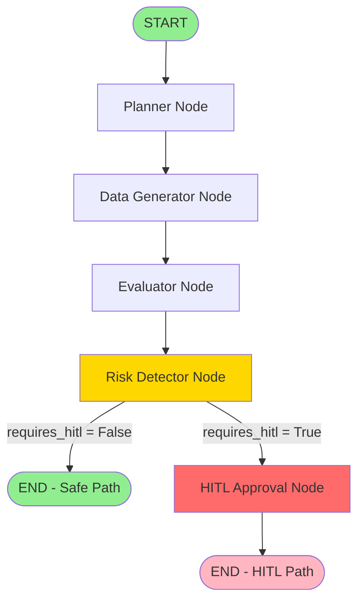

# Lab 17: LangGraph Workflow Documentation

## Overview

This document describes the graph-based supervisory workflow for due diligence dashboard generation. The workflow uses LangGraph to orchestrate a multi-stage process with conditional branching based on risk assessment.

## Workflow Graph



## Node Descriptions

### 1. Planner Node

**Purpose:** Creates execution plan and initializes workflow run.

**Responsibilities:**
- Generates unique `run_id` for tracking
- Creates execution plan with pipeline configuration
- Sets parameters (e.g., `top_k` for RAG retrieval)

**Input State:**
```python
{
    "company_id": "anthropic"
}
```

**Output State:**
```python
{
    "company_id": "anthropic",
    "run_id": "anthropic_20250114_143022_abc123",
    "execution_plan": {
        "company_id": "anthropic",
        "run_id": "anthropic_20250114_143022_abc123",
        "pipelines": {
            "structured": True,
            "rag": True
        },
        "rag_params": {
            "top_k": 10
        },
        "priority": "normal",
        "created_at": "2025-01-14T14:30:22"
    }
}
```

**Next Node:** `data_generator`

---

### 2. Data Generator Node

**Purpose:** Gathers data from multiple sources for dashboard generation.

**Responsibilities:**
- Loads structured payload from `data/payloads/{company_id}.json`
- Calls RAG API endpoint to retrieve vector DB insights
- Aggregates data from both pipelines

**Input State:**
```python
{
    "company_id": "anthropic",
    "run_id": "...",
    "execution_plan": {...}
}
```

**Output State:**
```python
{
    ...previous fields...,
    "structured_data": {
        "company_id": "anthropic",
        "snapshots": [...]
    },
    "rag_insights": [
        {
            "chunks_used": 10,
            "dashboard_preview": "...",
            "source": "vector_db",
            "retrieved_at": "2025-01-14T14:30:25"
        }
    ]
}
```

**Next Node:** `evaluator`

---

### 3. Evaluator Node

**Purpose:** Generates dashboard and scores its quality.

**Responsibilities:**
- Calls structured dashboard API endpoint
- Generates dashboard markdown
- Scores dashboard quality using rubric (1-10 scale)
- Evaluates: schema adherence, provenance, factual correctness, readability

**Input State:**
```python
{
    "company_id": "anthropic",
    "structured_data": {...},
    "rag_insights": [...]
}
```

**Output State:**
```python
{
    ...previous fields...,
    "dashboard": "## Company Overview\n...",
    "dashboard_score": 8.5
}
```

**Scoring Criteria:**
- Schema adherence (8 sections): 0-2 points
- "Not disclosed." usage: 0-2 points
- Word count (readability): 0-1 point
- Provenance indicators: 0-2 points
- Factual correctness proxy: 0-3 points

**Next Node:** `risk_detector`

---

### 4. Risk Detector Node

**Purpose:** Analyzes data and dashboard for risk signals and determines if human review is needed.

**Responsibilities:**
- Scans `structured_data` for risk indicators
- Analyzes `rag_insights` for risk keywords
- Checks `dashboard` content for concerning patterns
- Classifies risk severity (high/medium/low)
- Sets `requires_hitl` flag based on risk assessment

**Input State:**
```python
{
    "company_id": "anthropic",
    "structured_data": {...},
    "rag_insights": [...],
    "dashboard": "..."
}
```

**Output State:**
```python
{
    ...previous fields...,
    "risk_signals": [
        {
            "type": "layoffs",
            "severity": "high",
            "details": "Layoffs mentioned: 500 employees (15%)",
            "source": "structured_data",
            "keyword_matched": "layoff"
        }
    ],
    "requires_hitl": True
}
```

**Risk Keyword Categories:**

**High Severity:**
- `layoff`, `layoffs`, `reduction in force`, `rif`
- `breach`, `data breach`, `security breach`, `cyber attack`
- `scandal`, `fraud`, `embezzlement`, `corruption`
- `lawsuit`, `litigation`, `legal action`, `class action`
- `bankruptcy`, `chapter 11`, `insolvency`, `liquidation`

**Medium Severity:**
- `investigation`, `sec investigation`, `regulatory investigation`
- `regulatory action`, `compliance violation`, `fined`
- `churn`, `customer churn`, `high churn`
- `turnover`, `executive turnover`, `leadership turnover`
- `restructuring`, `downsizing`, `cost cutting`

**Low Severity:**
- `concern`, `risk`, `challenge`, `uncertainty`
- `volatility`, `market risk`, `competition`

**HITL Trigger Conditions:**
1. Any high-severity risk found → `requires_hitl = True`
2. 3+ medium-severity risks found → `requires_hitl = True`
3. High risk_score (>=70) in structured_data → `requires_hitl = True`
4. Layoffs >10% of workforce → `requires_hitl = True`

**Next Node:** Conditional routing based on `requires_hitl` flag

---

### 5. HITL Approval Node

**Purpose:** Handles high-risk cases requiring human review and approval.

**Responsibilities:**
- Logs all risk signals for human review
- Displays high-severity risks prominently
- Waits for human approval (in production)
- Sets `hitl_approved` flag

**Input State:**
```python
{
    "company_id": "risky_company",
    "risk_signals": [
        {"type": "layoffs", "severity": "high", ...},
        {"type": "breach", "severity": "high", ...}
    ],
    "dashboard": "...",
    "requires_hitl": True
}
```

**Output State:**
```python
{
    ...previous fields...,
    "hitl_approved": True
}
```

**Note:** In current implementation, this node auto-approves. In production, it would:
- Send notification to human reviewer
- Wait for approval/rejection
- Update `hitl_approved` flag based on human decision
- Potentially route back to `risk_detector` if changes needed

**Next Node:** `END`

---

## Conditional Routing

### Routing Function: `should_require_hitl()`

**Purpose:** Determines workflow path based on risk assessment.

**Logic:**
```python
if state["requires_hitl"] == True:
    return "hitl_required"  # Route to HITL node
else:
    return "safe_to_proceed"  # Route directly to END
```

### Two Execution Paths

#### Path 1: Safe Path (No High-Severity Risks)
```
START → planner → data_generator → evaluator → risk_detector → END
```

**Conditions:**
- No high-severity risks detected
- Less than 3 medium-severity risks
- Risk score < 70
- No layoffs >10% of workforce

**Final State:**
```python
{
    "company_id": "anthropic",
    "run_id": "...",
    "structured_data": {...},
    "rag_insights": [...],
    "dashboard": "...",
    "dashboard_score": 8.5,
    "risk_signals": [
        {"type": "leadership_instability", "severity": "medium", ...}
    ],
    "requires_hitl": False
}
```

#### Path 2: High-Risk Path (HITL Required)
```
START → planner → data_generator → evaluator → risk_detector → hitl_approval → END
```

**Conditions:**
- High-severity risk(s) detected
- 3+ medium-severity risks
- Risk score >= 70
- Layoffs >10% of workforce

**Final State:**
```python
{
    "company_id": "risky_company",
    "run_id": "...",
    "structured_data": {...},
    "rag_insights": [...],
    "dashboard": "...",
    "dashboard_score": 7.0,
    "risk_signals": [
        {"type": "layoffs", "severity": "high", ...},
        {"type": "rag_high_severity_keyword", "severity": "high", ...}
    ],
    "requires_hitl": True,
    "hitl_approved": True
}
```

---

## State Schema

```python
class WorkflowState(TypedDict):
    company_id: str                    # Company identifier
    run_id: str                        # Unique run identifier
    structured_data: Optional[Dict]    # Normalized structured payload
    rag_insights: Optional[List[Dict]] # RAG retrieval results
    risk_signals: Optional[List[Dict]] # Detected risk signals
    dashboard: Optional[str]           # Generated dashboard markdown
    dashboard_score: Optional[float]   # Quality score (1-10)
    requires_hitl: bool                # Flag for human approval needed
    hitl_approved: bool                # Flag for human approval received
    execution_plan: Optional[Dict]     # Execution plan from planner
    error: Optional[str]               # Error message if any
```

---

## Example State Transitions

### Example 1: Safe Company (Anthropic)

**Step 1: Planner**
```python
Input:  {"company_id": "anthropic"}
Output: {"company_id": "anthropic", "run_id": "...", "execution_plan": {...}}
```

**Step 2: Data Generator**
```python
Input:  {"company_id": "anthropic", "execution_plan": {...}}
Output: {"structured_data": {...}, "rag_insights": [...]}
```

**Step 3: Evaluator**
```python
Input:  {"structured_data": {...}, "rag_insights": [...]}
Output: {"dashboard": "...", "dashboard_score": 8.5}
```

**Step 4: Risk Detector**
```python
Input:  {"dashboard": "...", "structured_data": {...}}
Output: {"risk_signals": [], "requires_hitl": False}
```

**Step 5: Routing**
```python
Input:  {"requires_hitl": False}
Output: "safe_to_proceed" → END
```

### Example 2: High-Risk Company

**Step 1-3: Same as Example 1**

**Step 4: Risk Detector**
```python
Input:  {"dashboard": "...", "structured_data": {...}}
Output: {
    "risk_signals": [
        {"type": "layoffs", "severity": "high", ...}
    ],
    "requires_hitl": True
}
```

**Step 5: Routing**
```python
Input:  {"requires_hitl": True}
Output: "hitl_required" → hitl_approval
```

**Step 6: HITL Approval**
```python
Input:  {"requires_hitl": True, "risk_signals": [...]}
Output: {"hitl_approved": True}
```

**Step 7: END**

---

## Usage

### Command Line Interface

```bash
# Basic usage
python src/workflows/due_diligence_graph.py anthropic

# With custom run_id
python src/workflows/due_diligence_graph.py anthropic custom_run_123

# With verbose output (if --verbose flag added)
python src/workflows/due_diligence_graph.py --company anthropic --verbose
```

### Programmatic Usage

```python
from src.workflows.due_diligence_graph import run_due_diligence_workflow

# Run workflow
result = run_due_diligence_workflow("anthropic")

# Access results
print(f"Dashboard Score: {result['dashboard_score']}/10")
print(f"Risk Signals: {len(result['risk_signals'])}")
print(f"Requires HITL: {result['requires_hitl']}")
```

### Testing

```bash
# Run all tests
pytest tests/test_workflow_branches.py -v

# Run specific test class
pytest tests/test_workflow_branches.py::TestSafePathWorkflow -v

# Run with coverage
pytest tests/test_workflow_branches.py --cov=src.workflows --cov-report=html
```

---

## Error Handling

Each node includes error handling:

- **Planner:** Returns error if `company_id` missing
- **Data Generator:** Logs warnings if payload/RAG data unavailable, continues with available data
- **Evaluator:** Returns error if dashboard generation fails
- **Risk Detector:** Returns error if risk detection fails
- **HITL Approval:** Logs risks and handles approval/rejection

Errors are stored in state as `error` field and workflow can be configured to handle them appropriately.

---

## Future Enhancements

1. **Real HITL Integration:** Connect to human review system (Slack, email, web UI)
2. **Retry Logic:** Add retry mechanisms for API calls
3. **Checkpointing:** Use LangGraph checkpoints for state persistence
4. **Parallel Execution:** Run RAG and structured data generation in parallel
5. **Risk Scoring Refinement:** More sophisticated risk scoring algorithms
6. **Dashboard Regeneration:** Allow HITL to request dashboard regeneration with different parameters

---

## References

- [LangGraph Documentation](https://langchain-ai.github.io/langgraph/)
- [StateGraph API](https://langchain-ai.github.io/langgraph/reference/graphs/#langgraph.graph.StateGraph)
- Lab 17 Assignment Requirements

